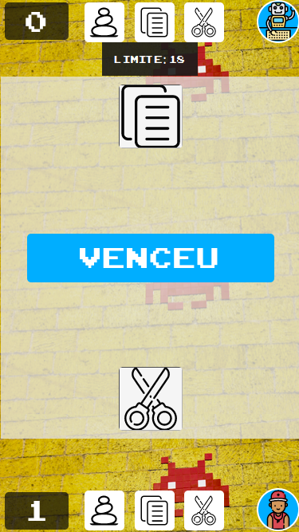

<!-- Please update value in the {}  -->

<h1 align="center"><a href="https://eufraniodiogo.github.io/Rock-Paper-Scissor">Rock Paper Scissor(Pedra Papel Tesoura)</a></h1>

  <h3>
    <a href="https://eufraniodiogo.github.io/Weather-App">
      Demo
    </a>
     | 
    <a href="https://github.com/EufranioDiogo/Weather-App">
      Solution
    </a>
  </h3>

A game that I build simulating the game that I played when I was a kid, and never knew that one day I'll be doing this game at digital way! :cry: :smile: 

## Table of Contents

- [Table of Contents](#table-of-contents)
- [Overview](#overview)
  - [Built With](#built-with)
- [Contact](#contact)

<!-- OVERVIEW -->

## Overview

- Where can I see your demo? 
  [Here](https://eufraniodiogo.github.io/Rock-Paper-Scissor)
- What was your experience? 
  It was a very cool project to pratice and learn new stuff!
- What have you learned/improved? 
  I learned more about working with apis and asynchronous functions in JavaScript.

### Built With

<!-- This section should list any major frameworks that you built your project using. Here are a few examples.-->

- JS
- HTML
- CSS

## Contact

- [Website](https://eufraniodiogo.github.io)
- [GitHub](https://github.com/EufranioDiogo)
- Email: eufraniodiogo5@gmail.com
